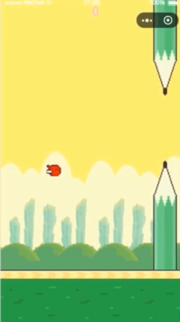

## FlappyBird

- master 分支为微信客户端版本
- JavaScript 分支为浏览器客户端版本

## 小游戏开发
- 小游戏逻辑梳理
- 小游戏呈现的原理解读
- 小游戏框架和基类创建与开发
- canvas 填坑

### 模块分解
- game.js 游戏全局入口文件，是微信小游戏必须有的一个文件。
- Main.js 程序主类，主要用来初始化 canvas 和一些全局对象，各个精灵和绑定点击事件。
- Director.js 程序导演类，用来控制游戏的逻辑和精灵的创建与销毁，控制游戏主循环。
- DataStore.js 存储游戏需要长期保存的变量和要定时销毁的变量。
- Resources.js 游戏的资源
- ResourceLoader.js 资源加载器，保证游戏是在图片加载完成后开始主循环。
- Sprite.js 游戏精灵的基类，背景、陆地、铅笔、小鸟等都是它的子类。
- Background.js 背景类
- Land.js 陆地类
- UpPencil.js 上半部分铅笔类
- DownPencil.js 下半部分铅笔类
- Birds.js 小鸟类
- Score.js 计分类器
- StartButton.js 重新开始按钮类

推荐live-server开启服务

手机工具：AirDroid

## 需要关注的几个 API
- wx.triggerGC() 垃圾回收
- wx.createInnerAudioContext() 创建背景音乐
